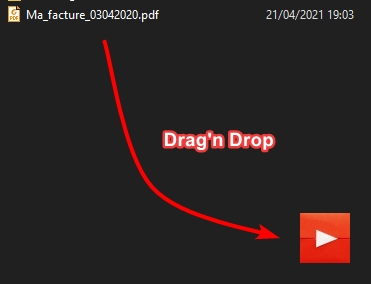
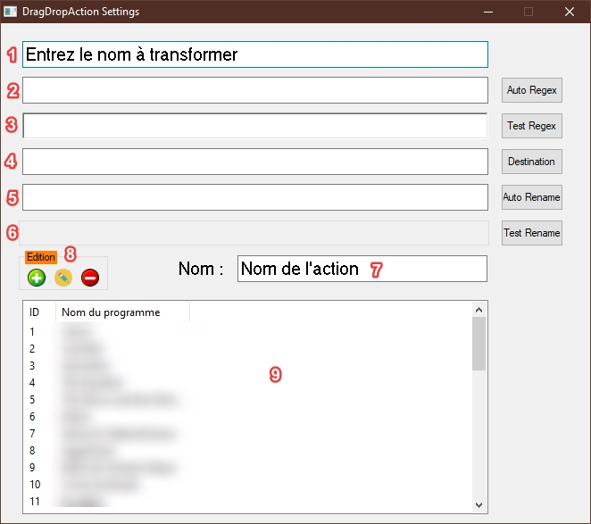
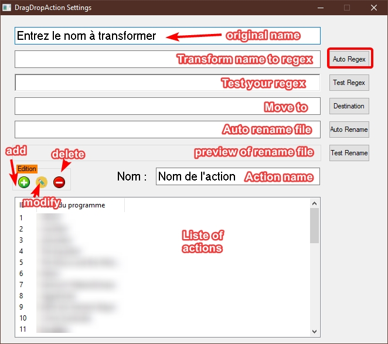
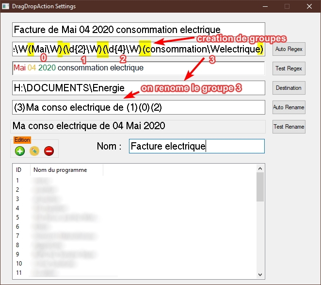

# DragDropAction 

## Status

Version en cours de developpement.

## Description

L'utilisation de ce logiciel nécessite quelques notions sur les expressions réguliéres. 

Il est scindé en deux programmes : la fenêtre où l'on glisse les fichiers et l'outil de paramétrage.

Il sert à ranger et renommer des fichiers par lot.

## Utilisation

DragDropAction est simple d'utilisation, il suffit de faire glisser les fichiers vers l'icône

Faîtes un clic droit sur la fenêtre pour accèder aux parametres

Voici la fenêtre des paramétres :

1. Le nom du fichier original

2. Lorsque vous cliquez sur `Auto Regex` le nom en `1` est transformé en expression régulière

   💡 C'est ici que __vous__ __créez__ __vos__ __groupes__ en ajoutant des parathèses pour former une capture
   
3. Le bouton `Test Regex` test l'expression régulière `2`

4. Le bouton `Destination` permet de choisir l'endroit où vous souhaitez déplacer le fichier.

   💡 Si un dossier n'existe pas il est créé automatiquement.
   
5. Le bouton `Auto Rename` permet de régler le renommage. Chaque chiffres entre parenthèse correspond
   à un groupe capturé. Ici on peut changer l'ordre des groupes pour renommer les fichiers.
   
   💡 On peut aussi remplacer la capture par un mot ou une phrase.
   
6. Le bouton `Test Rename` permet de voir le résultat du nom renommé.

7. C'est le nom que vous donnez à votre action.

8. Le menu édition permet d'ajouter une action, de la modifier ou de la supprimer.

9. La liste des actions enrgistrées.

Informatons en anglais

Example :

## Historique

21-04-21 : Correction de du champ `Test Regex` pour plus de 4 groupes

21-04-21 : Modification du Readme

20-04-21 : Création du dépôt et livraison des fichiers